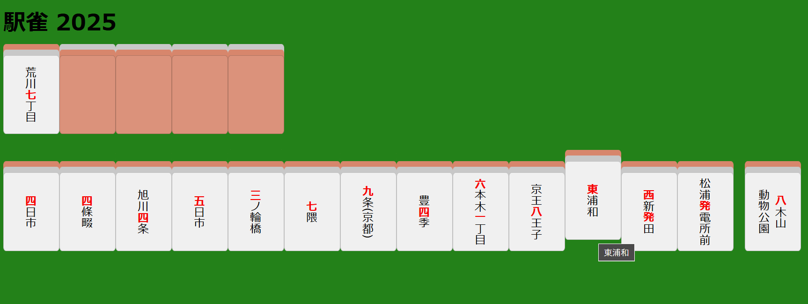

# えきじゃん

## 何

駅名で麻雀をします。

## なんで

やりたかったので。

## どうやって

一人用ならReactでできそう。

## とりあえずのよてい

- 牌のデータリストを作る →OK！
- 牌にタグ付けする →OK！
- 役を作る
- 手牌を作る →OK！
- 河を作る
- 牌を捨ててツモる

## りれき

### [2025/01/21]

- 初期手牌とツモ牌を分けた

### [2025/01/20]

- ドラ牌作成できた
- 初期手牌作成できた
- 数字とかに色付け

### [2025/01/19]

- 駅データセットできた
- 山のランダム化できた
- ページ読み込み時にランダム山生成
- スタートボタンで開始

### [2025/01/16]

- 駅データセット作業中

### [2025/01/15]

- リポジトリ生やした
